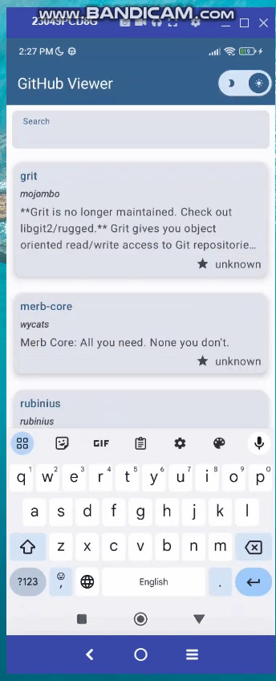

# GiHub Viewer

## Table of Contents
- [Description](#description)
- [Installations](iInstructions)
- [Screenshots](#screenshots)

## Description

A native android app that allows users to view repositories from GitHub, using Compose, view-model, Dagger-Hilt, Navigation graph and much more...

## Instructions

To build and run the app:
1. Ensure that you have the latest version of Android Studio installed.
2. The project uses: Gradle 8.0

## Screenshots

1- The app has search functionality and can handle errors.

2- Handled pagingation with Room in the main screen and with Retrofit in the issues screen using Paging 3.

3- The application supports both light and dark modes.

